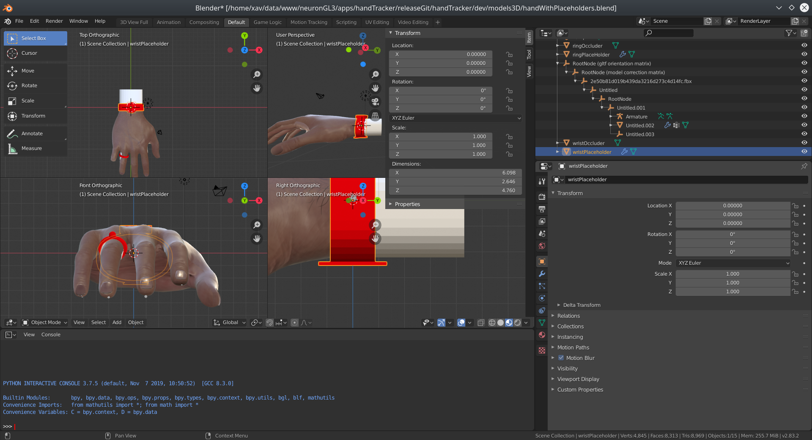

# JavaScript/WebGL lightweight and robust hand tracking library


## Table of contents

* [Features](#features)
* [Architecture](#architecture)
* [Demonstrations](#demonstrations)
  * [Third party](#third-party)
* [Specifications](#specifications)
  * [Get started](#get-started)
  * [Optionnal init arguments](#optionnal-init-arguments)
  * [Error codes](#error-codes)
  * [The returned objects](#the-returned-objects)
  * [Miscellaneous methods](#miscellaneous-methods)
  * [Using module](#using-module)
* [Virtual Try-on and object manipulation](#virtual-try-on-and-object-manipulation)
* [Hosting](#hosting)
* [About the tech](#about-the-tech)
  * [Under the hood](#under-the-hood)
  * [Compatibility](#compatibility)
* [License](#license)
* [References](#references)


## Features

Here are the main features of the library:

* hand detection and tracking,
* hand side detection (left or right, back or palm),
* hand keypoint detection and tracking.


## Architecture

* `/demos/`: source code of the demonstrations, sorted by 2D/3D engine used,
* `/dist/`: core of the library: 
  * `WebARRocksHand.js`: main minified script,
  * `HandTracker.module.js`: main minified script for use as a module (with `import` or `require`),
* `/helpers/`: scripts which can help you to use this library in some specific use cases,
* `/libs/`: 3rd party libraries and 3D engines used in the demos,
* `/neuralNets/`: neural networks models,
* `/reactThreeFiberDemos`: Demos with Webpack/NPM/React/Three Fiber.

## Demonstrations

The best demos have been ported to a modern front-end development environment (NPM / Webpack / React / Three Fiber / ES6) in  the [/reactThreeFiberDemos](/reactThreeFiberDemos) directory. This is a standalone directory.


* Boilerplate demo (display landmarks): [live demo](https://webar.rocks/demos/hand/demos/basic/), [source code](/demos/basic/)

* Hand VTO:
  * Wrist and ring VTO: [live demo](https://webar.rocks/demos/hand/demos/VTO/), [source code](/demos/VTO/)
  * Wrist watch realistic VTO: [live demo](https://webar.rocks/demos/hand/demos/VTOWatchOnly/), [source code](/demos/VTOWatchOnly/)

* Hand based navigation:
  * https://webar.rocks like navigation: [live demo](https://webar.rocks/demos/hand/demos/navigation/), [source code](/demos/navigation/)
  * Slideshow presentation (for desktop): [live demo](https://webar.rocks/demos/hand/demos/navigation2/), [source code](/demos/navigation2/)

* Foot VTO: 
  * Barefoot VTO: [live demo](https://webar.rocks/demos/hand/demos/bareFootVTO/), [source code](/demos/bareFootVTO/)
  * Shoes on and barefoot VTO: [live demo](https://webar.rocks/demos/hand/demos/footVTO/), [source code](/demos/footVTO/)

* 3D Object manipulation: 
  * Boilerplate: [live demo](https://webar.rocks/demos/hand/demos/objectManip/), [source code](/demos/objectManip)
  * Velociraptor demo: [live demo](https://webar.rocks/demos/hand/demos/objectManip2/), [source code](/demos/objectManip2)
  * Cute ghost demo: [live demo](https://webar.rocks/demos/hand/demos/objectManip3/), [source code](/demos/objectManip3)
  * Velociraptor demo with persistency if hand tracking is lost: [live demo](https://webar.rocks/demos/hand/demos/objectManip4/), [source code](/demos/objectManip4)

To run the demonstrations, serve the content of this directory using a static HTTP server (More info in [Hosting section](#hosting).

### Third-Party

These demonstrations are not created or maintained by WebAR.rocks:

* Shoes VTO with Angular16 by [Jiaying Ong](https://github.com/Candyzorua) - [Github repository](https://github.com/Candyzorua/ar-demo)


## Specifications

### Get started
On your HTML page, you first need to include the main script between the tags `<head>` and `</head>`:

```html
 <script src="dist/WebARRocksHand.js"></script>
```

Then you should include a `<canvas>` HTML element in the DOM, between the tags `<body>` and `</body>`. The `width` and `height` properties of the `<canvas>` element should be set. They define the resolution of the canvas and the final rendering will be computed using this resolution. Be careful to not enlarge too much the canvas size using its CSS properties without increasing its resolution, otherwise it may look blurry or pixelated. We advise to fix the resolution to the actual canvas size. Do not forget to call `WEBARROCKSHAND.resize()` if you resize the canvas after the initialization step.

```html
<canvas width="600" height="600" id='yourCanvas'></canvas>
```

This canvas will be used by WebGL both for the computation and the rendering of the video. It is not costly to render the video using this canvas because the video is already transfered into a `WebGLTexture` element to feed the neural network. And it allows to apply shader effects to the video.

When your page is loaded you should launch this function:
```javascript
WEBARROCKSHAND.init({
  canvasId: 'yourCanvas',
  NNsPaths: [...], // path to JSON neural networks models
  callbackReady: function(errCode, spec){
    if (errCode){
      console.log('AN ERROR HAPPENS. ERROR CODE =', errCode);
      return;
    }
    [init scene with spec...]
    console.log('INFO: WEBARROCKSHAND IS READY');
  }, //end callbackReady()

  // called at each render iteration (drawing loop)
  callbackTrack: function(detectState){
    // render your scene here
    [... do something with detectState]
  } //end callbackTrack()
});//end init call
```


### Optionnal init arguments
* `<integer> animateDelay`: Number of milliseconds during which the browser wait at the end of the rendering loop before starting another detection. The default value is `1`,
* `<function> onWebcamAsk`: Function launched just before asking for the user to allow access to its camera,
* `<function> onWebcamGet`: Function launched just after the user has accepted to share its video. It is called with the video element as argument,
* `<dict> videoSettings`: override MediaStream API specified video settings, which are by default:
```javascript
{
  'videoElement' // not set by default. <video> element used
   // If you specify this parameter,
   // all other settings will be useless
   // it means that you fully handle the video aspect

  'deviceId'            // not set by default
  'facingMode': 'user', // to use the rear camera, set to 'environment'

  'idealWidth': 800,  // ideal video width in pixels
  'idealHeight': 600, // ideal video height in pixels
  'minWidth': 480,    // min video width in pixels
  'maxWidth': 1280,   // max video width in pixels
  'minHeight': 480,   // min video height in pixels
  'maxHeight': 1280,  // max video height in pixels,
  'rotate': 0         // rotation in degrees possible values: 0,90,-90,180
},
```
* `<dict> scanSettings`: override scan settings - see `set_scanSettings(...)` method for more information,
* `<dict> stabilizationSettings`: override tracking stabilization settings - see `set_stabilizationSettings(...)` method for more information,
* `[<objects>] NNs` or `[<string>] NNsPaths`: trained neural networks models in use,
* `<boolean> followZRot`: If the neural network detection window should rotate to better track the hand. Default is `true`,
* `<boolean> freeZRot`: If the initial rotation value of the detection window should vary or not. If set to `false`, we will only detect hands vertically aligned. Default is `true`.


If the user has a mobile device in portrait display mode, the width and height of these parameters are automatically inverted for the first camera request. If it does not succeed, we invert the width and height.


### Error codes
The initialization function ( `callbackReady` in the code snippet ) will be called with an error code ( `errCode` ). It can have these values:
* `false`: no error occurs,
* `"GL_INCOMPATIBLE"`: WebGL is not available, or this WebGL configuration is not enough (there is no WebGL2, or there is WebGL1 without OES_TEXTURE_FLOAT or OES_TEXTURE_HALF_FLOAT extension),
* `"ALREADY_INITIALIZED"`: the library has been already initialized,
* `"NO_CANVASID"`: no canvas ID was specified,
* `"INVALID_CANVASID"`: cannot found the `<canvas>` element in the DOM,
* `"INVALID_CANVASDIMENSIONS"`: the dimensions `width` and `height` of the canvas are not specified,
* `"WEBCAM_UNAVAILABLE"`: cannot get access to the camera (the user has no camera, or it has not accepted to share the device, or the camera is already busy),
* `"GLCONTEXT_LOST"`: The WebGL context was lost. If the context is lost after the initialization, the `callbackReady` function will be launched a second time with this value as error code,


### The returned objects
We detail here the arguments of the callback functions like `callbackReady` or `callbackTrack`. The reference of these objects do not change for memory optimization purpose. So you should copy their property values if you want to keep them unchanged outside the callback functions scopes.

#### The initialization returned object
The initialization callback function ( `callbackReady` in the code snippet ) is called with a second argument, `spec`, if there is no error. `spec` is a dictionnary having these properties:
* `GL`: the WebGL context. The rendering 3D engine should use this WebGL context,
* `canvasElement`: the `<canvas>` element,
* `videoTexture`: a WebGL texture displaying the camera video. It has the same resolution as the camera video,
* `[<float>, <float>, <float>, <float>]` videoTransformMat2: flatten 2x2 matrix encoding a scaling and a rotation. We should apply this matrix to viewport coordinates to render `videoTexture` in the viewport,
* `<HTMLVideoElement> video`: the video used as source for the webgl texture `videoTexture`,
* `[<string> landmarksLabels]`: the list of the landmark labels. This list depends on the neural network model,
* `<int> maxHandsDetected`: the maximum number of detected faces.


#### The detection state
At each render iteration a callback function is executed ( `callbackTrack` in the code snippet ). It has one argument ( `detectState` ) which is a dictionnary with these properties:
* `<float> detected`: the detection probability, between `0` and `1`,
* `<float> x`, `<float> y`: The 2D coordinates of the center of the detection frame in the viewport (each between -1 and 1, `x` from left to right and `y` from bottom to top),
* `<float> s`: the scale along the horizontal axis of the detection frame, between 0 and 1 (1 for the full width). The detection frame is always square,
* `<float> rx`, `<float> ry`, `<float> rz`: the Euler angles of the head rotation in radians.
* `<array> landmarks`: `[[<float> x_0, <float> y_0],...,[<float> x_n, <float> y_n]]`: detected landmarks. `x_i` and `y_i` are the relative coordinates of the `i`th landmark in the viewport coordinates (between `-1` and `1`, from left to right and from bottom to top).


### Miscellaneous methods
After the initialization (ie after that `callbackReady` is launched ) , these methods are available:

* `WEBARROCKSHAND.resize()`: should be called after resizing the `<canvas>` element to adapt the cut of the video,

* `WEBARROCKSHAND.toggle_pause(<boolean> isPause)`: pause/resume,

* `WEBARROCKSHAND.set_animateDelay(<integer> delay)`: Change the `animateDelay` (see `init()` arguments),

* `WEBARROCKSHAND.set_inputTexture(<WebGLTexture> tex, <integer> width, <integer> height)`: Change the video input by a WebGL Texture instance. The dimensions of the texture, in pixels, should be provided,

* `WEBARROCKSHAND.reset_inputTexture()`: Come back to the user's video as input texture,

* `WEBARROCKSHAND.get_videoDevices(<function> callback)`: Should be called before the `init` method. 2 arguments are provided to the callback function:
  * `<array> mediaDevices`: an array with all the devices founds. Each device is a javascript object having a `deviceId` string attribute. This value can be provided to the `init` method to use a specific camera. If an error happens, this value is set to `false`,
  * `<string> errorLabel`: if an error happens, the label of the error. It can be: `NOTSUPPORTED`, `NODEVICESFOUND` or `PROMISEREJECTED`.

* `WEBARROCKSHAND.set_scanSettings(<object> scanSettings)`: Override scan settings. `scanSettings` is a dictionnary with the following properties:
  * `<float> threshold`: detection threshold, between `0` and `1`. Default value is `0.97`. You can lower it if you want to make the detection more sensitive (but it will increase the false positive detections),
  * `<int> nDetectsPerLoop`: specify the number of detection per drawing loop. `0` for adaptative value. Default: `0`
  * `<int> nScaleLevels`: number of detection steps for the scale. Default: `4`,
  * `[<float>, <float>, <float>] overlapFactors`: overlap between 2 scan positions for `X`, `Y` and `scale`. Default: `[1.5, 1.5, 2]`,

* `WEBARROCKSHAND.set_stabilizationSettings(<object> stabilizationSettings)`: Override detection stabilization settings. The output of the neural network is always noisy, so we need to stabilize it using a floatting average to avoid shaking artifacts. The internal algorithm computes first a stabilization factor `k` between `0` and `1`. If `k==0.0`, the detection is bad and we favor responsivity against stabilization. It happens when the user is moving quickly, rotating the head or when the detection is bad. On the contrary, if `k` is close to `1`, the detection is nice and the user does not move a lot so we can stabilize a lot. `stabilizationSettings` is a dictionnary with the following properties:
  * `[<float> minValue, <float> maxValue] qualityFactorRange`: Default value: `[0.9, 0.98]`,
  * `[<float> minValue, <float> maxValue] alphaRange`: it specify how to apply `k`. Between 2 successive detections, we blend the previous `detectState` values with the current detection values using a mixing factor `alpha`. `alpha=<minValue>` if `k<0.0` and `alpha=<maxValue>` if `k>1.0`. Between the 2 values, the variation is quadratic.

* `WEBARROCKSHAND.update_videoElement(<video> vid, <function|False> callback)`: change the video element used for the detection (which can be provided via `VIDEOSETTINGS.videoElement`) by another video element. A callback function can be called when it is done.

* `WEBARROCKSHAND.update_videoSettings(<object> videoSettings)`: dynamically change the video settings (see [Optionnal init arguments](optionnal-init-arguments) for the properties of `videoSettings`). It is useful to change the camera from the selfie camera (user) to the back (environment) camera. A `Promise` is returned.

* `WEBARROCKSHAND.destroy()`: Clear both graphic memory and JavaScript memory, uninit the library. After that you need to init the library again. A `Promise` is returned.


### Using module

`/dist/HandTracker.module.js` is exactly the same as `/dist/WebARRocksHand.js` except that it works as a JavaScript module, so you can import it directly using:

```javascript
import 'dist/HandTracker.module.js'
```

or using `require`.


## Virtual Try-on and object manipulation

Virtual try-on (VTO) and object manipulation demos are provided in this repository.
They rely on the [THREE.js VTO helper](/helpers/HandTrackerVTOThreeHelper.js) to instantiate THREE.js objects and especially the scene, the camera and the 3D object tracking specific parts of the hand (the *tracker* ).

The *tracker* can follow the wrist for wrist watch or bracelet VTO, or the palm for object manipulation. The 3D mesh of the bracelet will be imported and added as a child of the tracker in the specific demo script.

There are 2 `<canvas>` elements overlaid in the DOM:

* The canvas used by `WEBARROCKSHAND` and to display the video. This canvas is below,
* The canvas used by THREE.js to render the scene.

To correctly set the position of the 3D mesh, you can open [dev/models3D/handWithPlaceholders.blend](/dev/models3D/handWithPlaceholders.blend) using [Blender](https://blender.org). The place holders are displayed in red and the occluder in white.
You can then import your own mesh, scale, rotate and translate it to match the right position, then apply scale rotation and offset and re-export it.

<p align="center">
  
</p>

Another solution consist in reporting the scale, position and rotation in the `demo.js` file and apply them with THREE.js.

The occluders are 3D meshes rendered with a transparent color. They mask part of the tracking object that are normally masked by the user's hand (the interior of a bracelet for example).


## Hosting

You should host the content of this repository using a HTTPS static server.

Be careful to enable gzip HTTP/HTTPS compression for JSON and JS files. Indeed, the .JSON neuron networks files are quite heavy, but very well compressed with GZIP. You can check the gzip compression of your server [here](https://checkgzipcompression.com/).

Neuron network files are loaded through `XMLHttpRequest` after calling `WEBARROCKSHAND.init()`. This loading is proceeded after the user has accepted to share its camera. So we won't load this quite heavy file if the user refuses to share it or if there is no camera available. The loading can be faster if you systematically preload the neural network files using a service worker or a simple raw `XMLHttpRequest` just after the HTML page loading. Then the file will be already in the browser cache when the library will request it.

Some directories of the latest version of this library are hosted on `https://cdn.webar.rocks/hand/` and served through a content delivery network (CDN):

* [/dist](/dist/)
* [/helpers](/helpers/)
* [/neuralNets](/neuralNets/)


## About the tech

### Under the hood

This libray uses [WebAR.rocks](https://webar.rocks) WebGL Deep Learning technology to detect and track the user's hand using a neural network. The accuracy is adaptative: the best is the hardware, the more detections are processed per second. All is done client-side.

### Compatibility

* If `WebGL2` is available, it uses `WebGL2` and no specific extension is required,
* If `WebGL2` is not available but `WebGL1`, we require either `OES_TEXTURE_FLOAT` extension or `OES_TEXTURE_HALF_FLOAT` extension,
* If `WebGL2` is not available, and if `WebGL1` is not available or neither `OES_TEXTURE_FLOAT` or `OES_HALF_TEXTURE_FLOAT` are implemented, the user is not compatible.

If `WebGL2` implementation is lame (like with IOS < 13.3.1), we will force the use of `WebGL1`.

If a compatibility error is triggered, please post an issue on this repository. If this is a problem with the camera access, please first retry after closing all applications which could use your device (Skype, Messenger, other browser tabs and windows, ...). Please include:
* a screenshot of [webglreport.com - WebGL1](http://webglreport.com/?v=1) (about your `WebGL1` implementation),
* a screenshot of [webglreport.com - WebGL2](http://webglreport.com/?v=2) (about your `WebGL2` implementation),
* the log from the web console,
* the steps to reproduce the bug, and screenshots.

Don't panic if you see errors and warning at initialization in the web console. Indeed, we always test all WebGL capabilities. These errors are caught.


## License

This code repository is dual licensed. You have to choose between these 2 licenses:

1. [GPLv3](GPLv3.txt) (free default option)
2. [Nominative commercial license](https://webar.rocks/buyCommercialLicense) (not free)

For more information, please read [LICENSE](/LICENSE) file.


## References
* [WebAR.rocks website](https://webar.rocks)
* [Blender website](https://www.blender.org/)
* [Webgl Academy: tutorials on WebGL and THREE.JS](http://www.webglacademy.com)
* [WebAR.rocks on Linkedin](https://www.linkedin.com/company/webar-rocks)
* [WebAR.rocks on Twitter](https://twitter.com/WebARRocks)